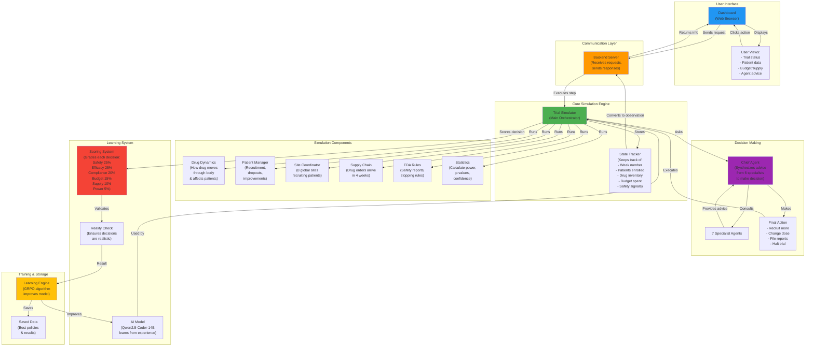

# Clinical Trial Simulator - Architecture & Workflow

## 1. System Architecture: How It Works



---

## 2. Project Workflow: What Happens When You Take An Action

```mermaid
graph TB
    START["User Opens Dashboard<br/>& Views Trial Status"] 
    
    START --> ACTION["User Chooses Action<br/>(e.g., 'Recruit 10 patients')"]
    
    ACTION --> SEND["Action Sent to Server"]
    
    SEND --> PARSE["Server Receives Request<br/>Parses action details<br/>(Type, magnitude, parameters)"]
    
    PARSE --> CONSULT["Trial Simulator Consults<br/>7 Specialist Agents<br/><br/>🔹 Safety Agent: Is it safe?<br/>🔹 Statistics: Will we have power?<br/>🔹 Pharmacology: Right dose?<br/>🔹 Patient Impact: Will patients drop out?<br/>🔹 Regulatory: FDA compliance?<br/>🔹 Budget: Can we afford it?<br/>🔹 Supply: Do we have drug?"]
    
    CONSULT --> SYNTHESIZE["Chief Agent Synthesizes<br/>All 6 pieces of advice<br/>Approves or modifies action"]
    
    SYNTHESIZE --> EXECUTE["Simulator Executes Action<br/><br/>Updates across components:<br/>🔹 Drug Dynamics: New patients get drug<br/>🔹 Biomarkers: Measure improvements<br/>🔹 Patient Tracking: New enrollments, dropouts<br/>🔹 Site Status: Update by location<br/>🔹 Supply: Deduct from inventory<br/>🔹 Budget: Track spending<br/>🔹 Safety: Count adverse events<br/>🔹 Statistics: Recalculate power & p-value"]
    
    EXECUTE --> CALCULATE["Score the Decision<br/><br/>Safety Score:<br/>  - Did anyone get hurt?<br/>  - Reports filed on time?<br/><br/>Efficacy Score:<br/>  - Did treatment work better than control?<br/><br/>Compliance Score:<br/>  - Followed all FDA rules?<br/><br/>Budget Score:<br/>  - Used money wisely?<br/><br/>Supply Score:<br/>  - Drug inventory ok?<br/><br/>Power Score:<br/>  - Enough patients for proof?"]
    
    CALCULATE --> VALIDATE["Reality Check<br/><br/>Ensures decision wasn't:<br/>  - Medically impossible<br/>  - Logistically broken<br/>  - Designed to game the system"]
    
    VALIDATE --> COMBINE["Combine All Scores<br/>25% Safety + 25% Efficacy<br/>+ 20% Compliance + 15% Budget<br/>+ 10% Supply + 5% Power<br/><br/>= Total Reward/Penalty"]
    
    COMBINE --> LEARN["System Learns<br/><br/>Training algorithm sees:<br/>  - What state looked like<br/>  - What action was taken<br/>  - How good was the outcome<br/><br/>Updates AI model to<br/>make better decisions next time"]
    
    LEARN --> OBSERVE["Generate Observation<br/><br/>Package current trial info:<br/>  - Current week<br/>  - Total patients enrolled<br/>  - Biomarker improvement<br/>  - Serious adverse events count<br/>  - Drug concentration level<br/>  - Budget remaining<br/>  - Statistical power<br/>  - P-value<br/>  - FDA sentiment"]
    
    OBSERVE --> RETURN["Send to Dashboard"]
    
    RETURN --> DISPLAY["Display Updates<br/><br/>User sees:<br/>  - New week number<br/>  - Updated patient count<br/>  - Improved biomarkers on chart<br/>  - Budget spent so far<br/>  - Drug supply level<br/>  - Agent recommendations<br/>  - Reward points earned"]
    
    DISPLAY --> LOOP{"Continue<br/>Trial?"}
    
    LOOP -->|Yes| ACTION
    LOOP -->|No| END["Trial Complete<br/>Final Score Calculated<br/>Results Saved"]
    
    style ACTION fill:#2196F3
    style CONSULT fill:#9C27B0
    style EXECUTE fill:#FF9800
    style CALCULATE fill:#F44336
    style LEARN fill:#4CAF50
    style DISPLAY fill:#FFD700
    style END fill:#FF6B6B
```



---

## 3. How Each Component Works

### **Drug Dynamics (Pharmacokinetics)**
When a patient receives a dose:
- Drug enters bloodstream and distributes to tissues
- Concentration peaks and then decreases over time
- High concentration = more efficacy but also more toxicity
- Low concentration = safe but might not work
- Model calculates realistic absorption and elimination rates

### **Patient Management**
- Patients are recruited weekly from 8 global sites
- Each patient has unique characteristics (age, genetics, baseline health)
- Patients improve if drug works for them
- Patients drop out if:
  - Drug causes side effects
  - No improvement after waiting
  - Random life events
- Dropout reduces power to prove effectiveness

### **Safety Monitoring (FDA Rules)**
- Serious adverse events must be reported within 7-15 days
- Accumulating safety signals can trigger trial halt
- If too many patients get hurt, trial stops immediately
- Late reporting is penalized
- Independent board reviews safety every 8 weeks

### **Statistical Analysis**
- As patients are enrolled, their biomarkers are tracked
- Software calculates if treatment works better than control
- Calculates confidence (p-value) that difference isn't due to chance
- Determines if we have enough patients (statistical power)
- Can stop early if overwhelming evidence of success or failure

### **Supply Chain**
- When you order drug, it arrives in 4 weeks
- Drug expires after 18 months on shelf
- If inventory runs out, new patients can't be dosed
- Must plan ahead to avoid stockouts
- More patients = more drug needed

### **Budget Tracking**
- $50 million starting budget
- Each action costs money:
  - Recruiting patients: ~$10k per patient
  - Ordering drug supply: ~$50k per order
  - Safety meetings: ~$25k each
  - FDA interactions: ~$50k each
- Budget must last until trial ends

---

## 4. How The AI Model Learns

```
STEP 1: Collect Experience
  ├─ Run multiple trials with current AI
  ├─ Record what happened in each trial
  └─ Store: situation → action → outcome

STEP 2: Analyze Results
  ├─ Compare outcomes against baseline policies
  ├─ Calculate reward for each decision
  ├─ Find patterns: "This type of action works well in this situation"
  └─ Find mistakes: "This decision always backfires"

STEP 3: Improve Model
  ├─ Show model many examples of good vs bad decisions
  ├─ Adjust internal parameters to prefer good decisions
  ├─ Test improved model on new trials
  └─ If better than before, keep improvements

STEP 4: Repeat
  └─ Cycle back to STEP 1 with improved model

RESULT: Over time, model learns to:
  ├─ Recruit safely without causing stockouts
  ├─ Adjust doses based on drug concentration
  ├─ File safety reports on time
  ├─ Balance budget vs patient numbers
  ├─ Maintain statistical power
  └─ Make decisions that maximize success
```

---

## 5. Reward System Explained

Each decision gets scored on 6 dimensions:

| Dimension | Weight | What's Measured |
|-----------|--------|-----------------|
| **Safety** | 25% | Were patients protected? Were SAEs reported on time? |
| **Efficacy** | 25% | Did treated patients improve more than control? |
| **Compliance** | 20% | Were all FDA/regulatory rules followed? |
| **Budget** | 15% | Was money spent efficiently? |
| **Supply** | 10% | Was drug availability maintained? |
| **Power** | 5% | Do we have enough patients to prove it works? |

**Example Calculation:**
- You recruit 20 patients: Good for efficacy (+) but expensive (-)
- No adverse events: Good for safety (+)
- Drug still in stock: Good for supply (+)
- Budget now at 80% used: Slightly bad for budget (-)
- Total outcome: Strong positive score

---

## 6. When Trial Ends

Trial can end in three ways:

**✅ Success**
- Proof that treatment works better than control
- Safety record is clean
- Sufficient patients enrolled
- FDA approval likely
- High reward score

**❌ Failure**
- Not enough patients enrolled
- Treatment didn't show benefit
- Too much risk/not enough benefit
- Budget ran out
- Low reward score

**⏸️ Stopped for Safety**
- Too many serious adverse events
- Pattern of harm detected
- Regulatory board recommends halt
- Medium penalty for halting

---

## 7. System Performance Targets

| Metric | Expected Performance |
|--------|---------------------|
| **Response Time** | Each action processed in < 1 second |
| **Trial Duration** | Typically 40-60 weeks simulated time |
| **Patients Enrolled** | 50-200 depending on strategy |
| **AI Improvement** | Trained model 25%+ better than random actions |
| **Compliance Rate** | 90%+ safety reports filed on time |
| **Trial Success Rate** | 60%+ of trials achieve proof of effectiveness |

---

## 8. Key System Flows at a Glance

**Simple Action:**
- User clicks "Recruit 5" → Server executes → Biomarkers update → Charts refresh → Display new state

**Complex Decision:**
- User chooses "Request DSMB Review" → Consults all agents → Validates against rules → Updates regulatory status → Scores the impact → Shows outcome

**Learning Process:**
- Run 50 simulated trials → Collect all decisions & outcomes → Train AI model → Test on new trials → Save if improved → Repeat

---

## 9. Files & Data Organization

```
Main Components:
├─ Trial Simulator
│  └─ Manages state, runs physics, orchestrates agents
├─ 7 Specialist Agents
│  └─ Each provides advice, combined by chief agent
├─ Reward Calculator
│  └─ Scores decisions on 6 dimensions
├─ AI Model
│  └─ Qwen2.5-Coder-14B, learns from rewards
└─ Dashboard
   └─ Shows trial status & agent recommendations

Data Storage:
├─ Current Trial State
│  └─ Patient numbers, budget, biomarkers, etc.
├─ Saved Checkpoints
│  └─ Best AI models from training
├─ Results & Metrics
│  └─ Reward curves, policy comparisons
└─ Disease Profiles
   └─ Disease-specific parameters
```

---

## 10. Quick Reference: What Each Number Means

| Number | Meaning |
|--------|---------|
| **Week 12** | You're at week 12 of the trial |
| **Enrolled: 47** | 47 patients have started treatment |
| **Biomarker: 0.63** | Treated group's improvement is 63% |
| **SAEs: 2** | 2 serious side effects reported |
| **Power: 0.78** | 78% chance we can prove it works |
| **P-value: 0.041** | 4.1% chance this difference happened by luck |
| **Drug Stock: 180** | 180 doses available in inventory |
| **Budget Spent: $32M** | $32 million of $50M used |
| **Reward: +0.45** | This action scored 0.45 points (good!) |

